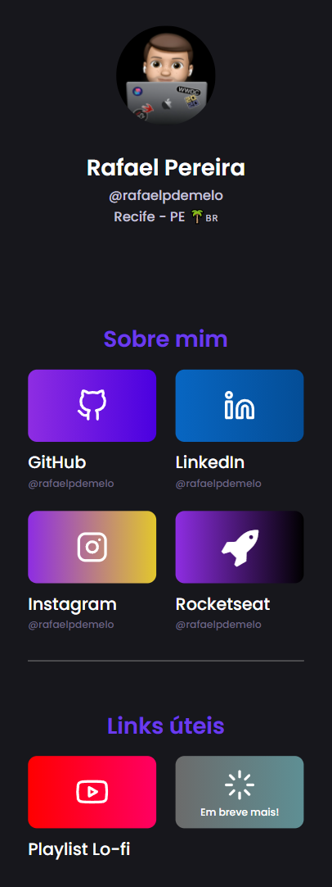

# Projeto InstaLink 👨‍💻
Projeto de links para instagram usando HTML e CSS! 
Clique aqui para olhar o projeto funcionando -> https://rafaelpdemelo.vercel.app/

# Versões Anteriores  
Versão numero 1 do projeto:

  

## Agradecimentos

[**giovannamoeller**](https://github.com/giovannamoeller) pela ideia e código base (=

